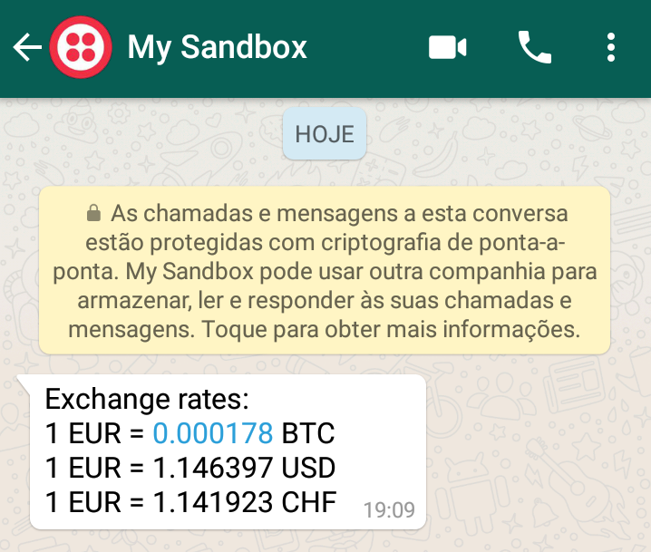

# Forex-On-Whatsapp

This project aims to scale up to an application to send the current exchange rate of a bunch of currencies to subscribed users by Whatsapp.


### Requirements
MongoDB

Python >=3.6

A Fixer API key (https://fixer.io/)

Twilio credentials (https://www.twilio.com/docs/iam/test-credentials)

### Setup
To install dependencies, run
```
pip3 install -r requirements.txt
```
You'll need some env vars, like the API

### Running the app

To get the app running, run
```
sudo service mongod start
python3 main.py
```
The app will be running on http://0.0.0.0:5000

The flask application exposes a few endpoints to subscribe users. To subscribe a user, POST /users/insert with the following payload:
```JSON
{
  "name": "ze das silvas",
  "phone_number": "5511964498206",
  "assets": [
	"BTC",
	"USD",
	"CHF"
  ]
}
```
The key `assets` is an array with the international code of the currencies whose exchange rates the user wants to receive.

### Running the Whatsapp sending job

Meanwhile, I've been testing this app with the Twilio Sandbox.

To run the job to send the Whatsapp messages, run
```
python3 run_jobs.py
```

I am still working to dockerize the whole application, also to schedule the Whatsapp sending task, and am looking forward to deploy a demo of it on AWS. I will also write some nice forms with React for the end user to interact with.

Enjoy!


